# 🛡️ RFID Employee Time Tracking System

A lightweight and extendable RFID-based employee entry/exit tracking system using PHP, MySQL, ESP8266, and RFID readers.

## 🚀 Features

- Register and manage employees with RFID cards
- Track employee entry and exit in real time
- View detailed daily logs and work hour summaries
- Admin dashboard with analytics and department breakdown
- Department management and reporting
- API endpoints for integrations

## 📸 Demo Screenshots

### 🔐 Home Page
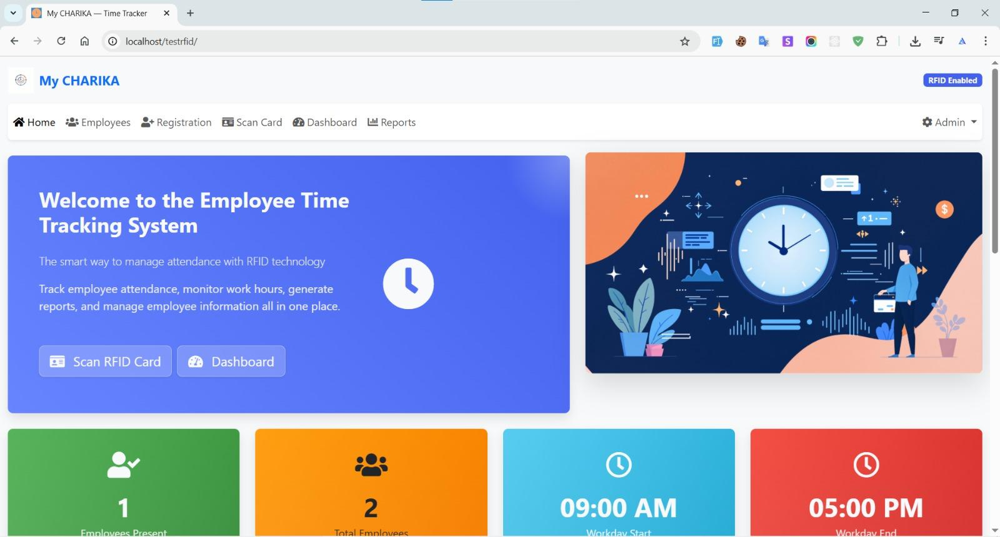

### 🏠 Home Dashboard
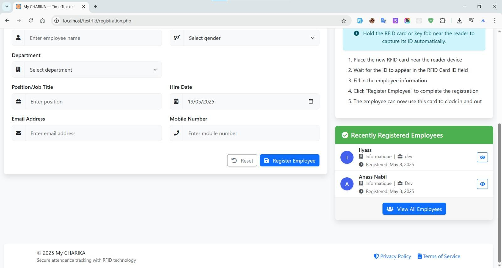
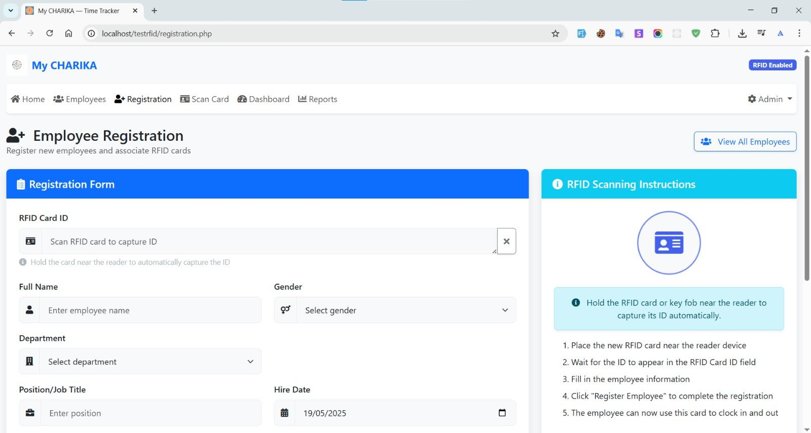
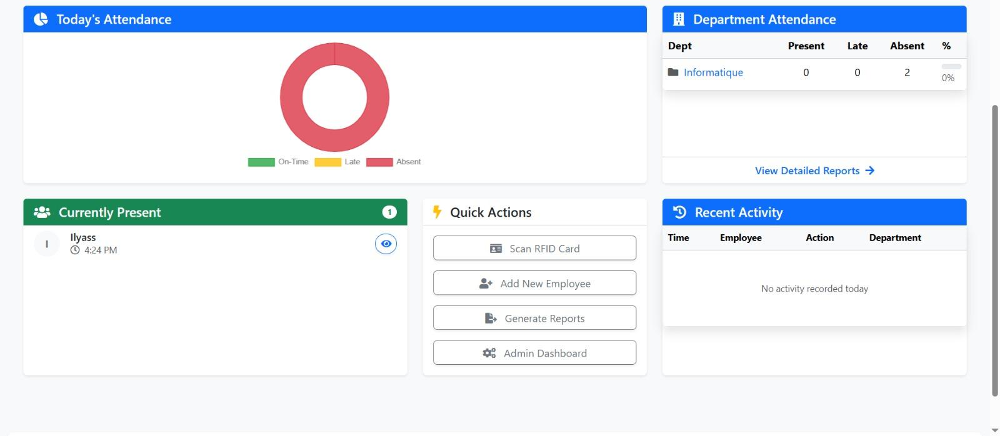
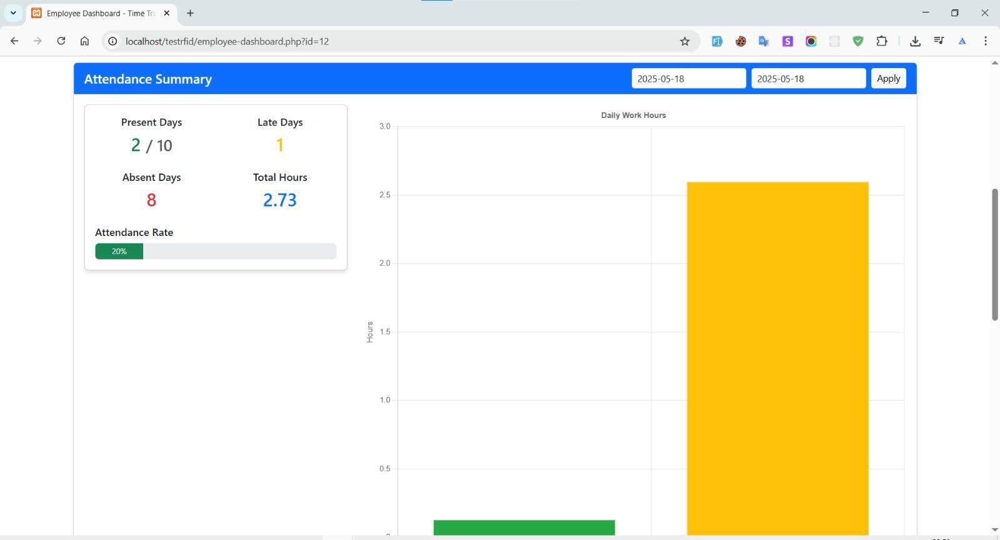
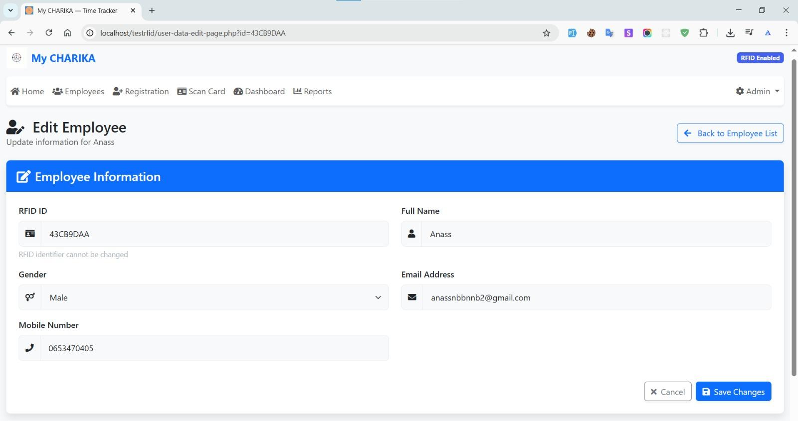
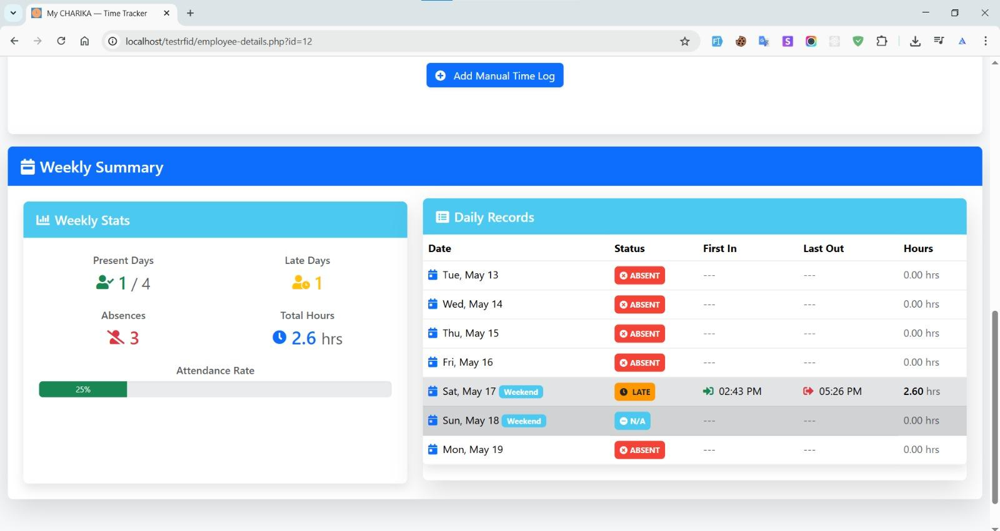
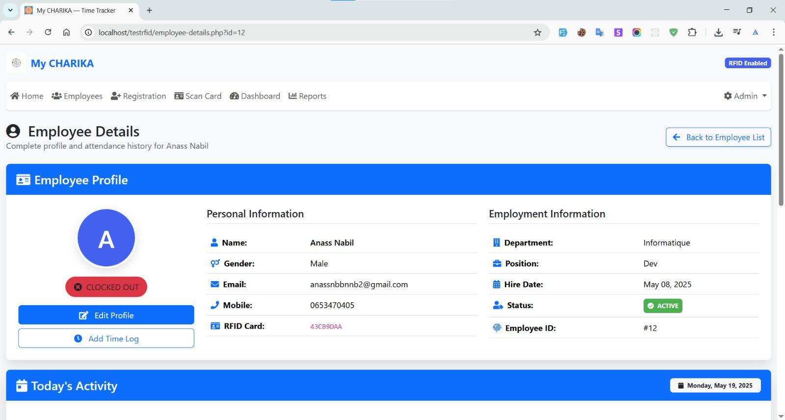
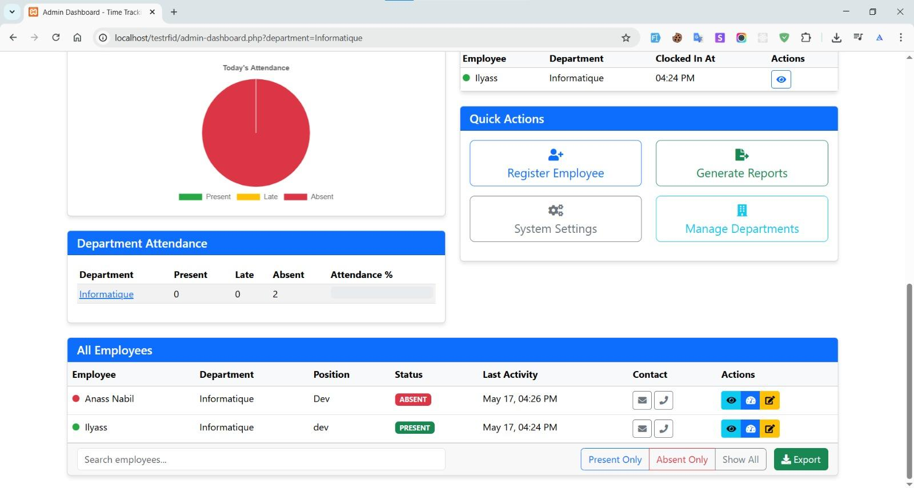
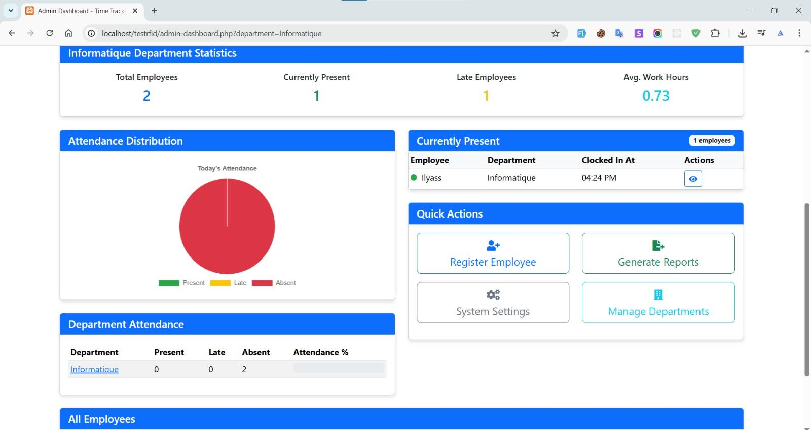
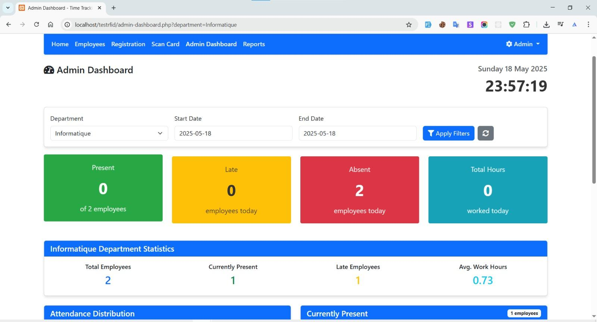
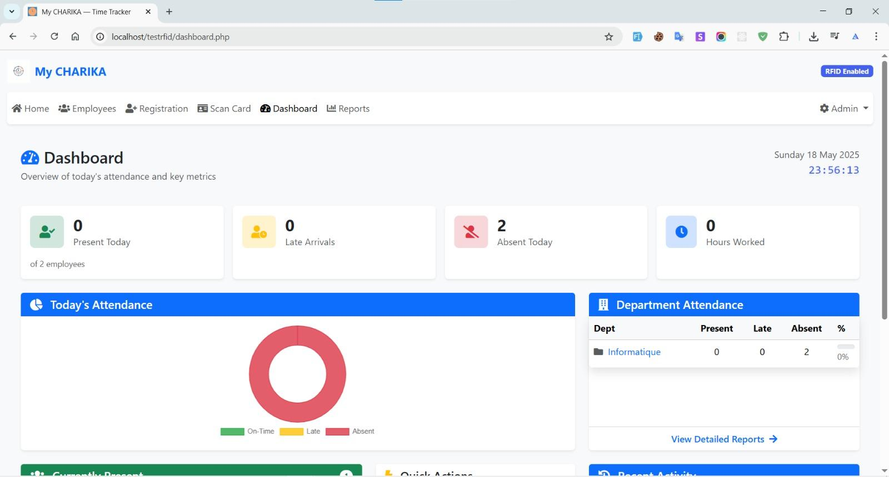

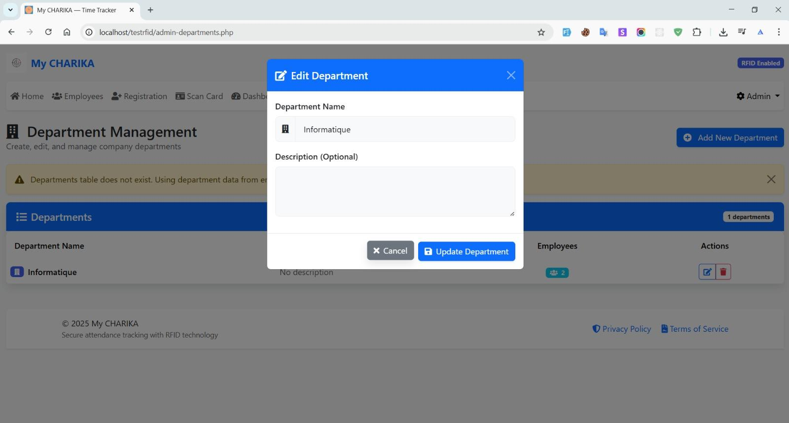
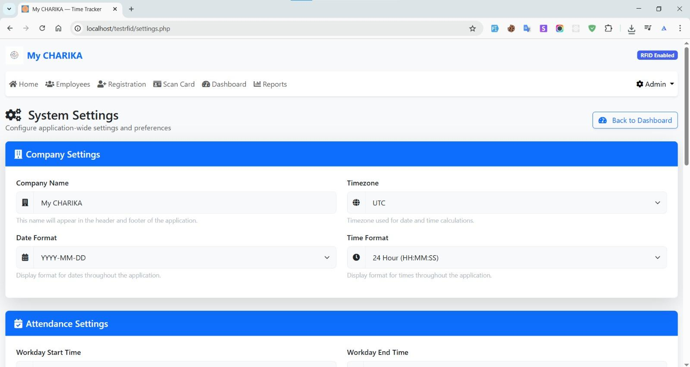
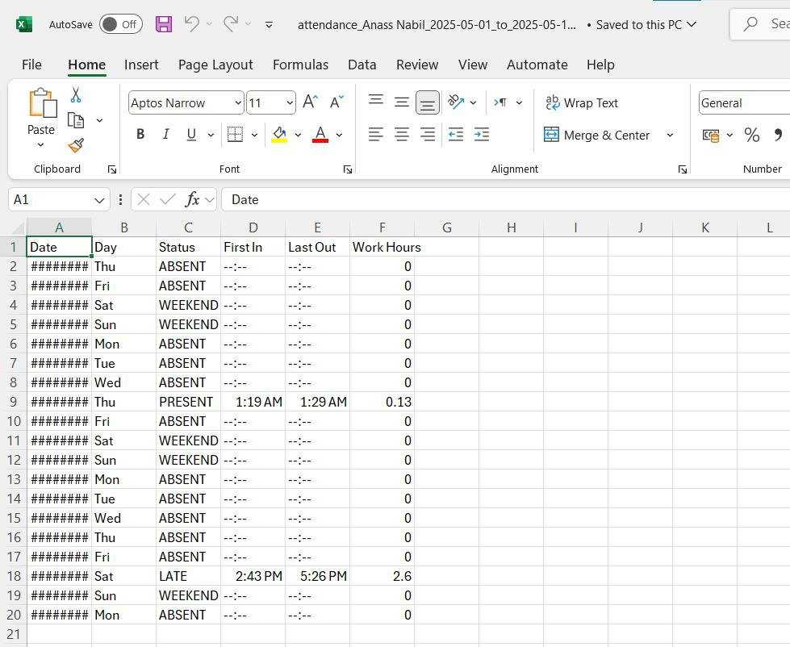
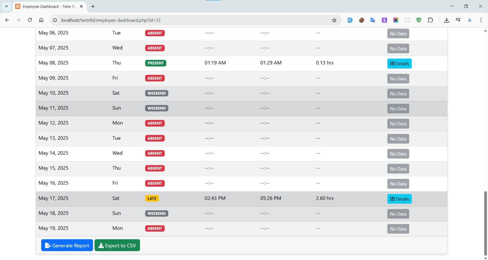
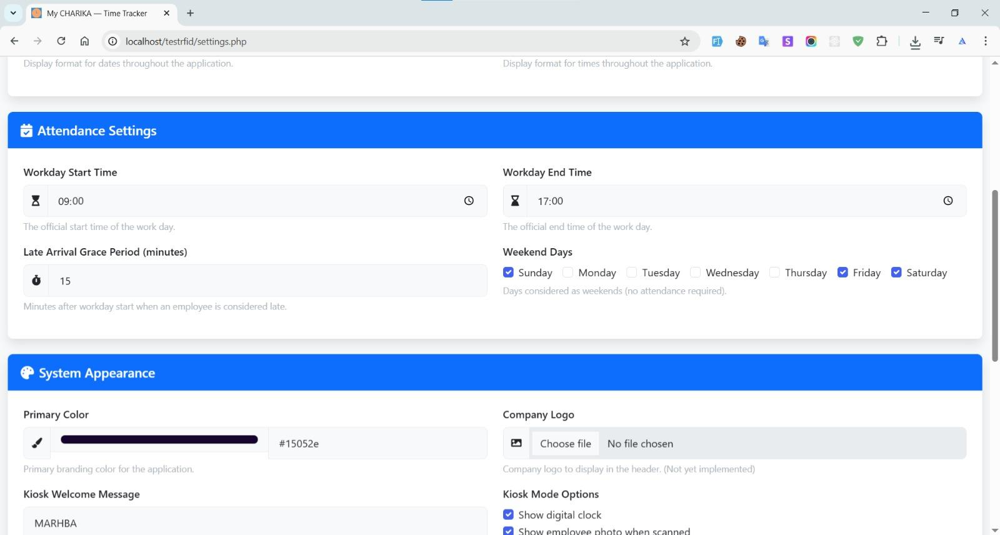


## 🗂️ Folder Structure

anass-nb-etracker/
├── admin-dashboard.php
├── registration.php
├── read-tag.php
├── read-tag-user-data.php
├── time_tracking.php
├── UIDContainer.php
├── user-data.php
├── daily-log.php
├── css/
│ └── styles.css
├── js/
│ └── time-tracking.js
├── includes/
│ ├── header.php
│ └── footer.php
├── rfid_esp.ino # ESP8266 microcontroller code
├── database.php
└── ...


---

## 🧪 Hardware Requirements
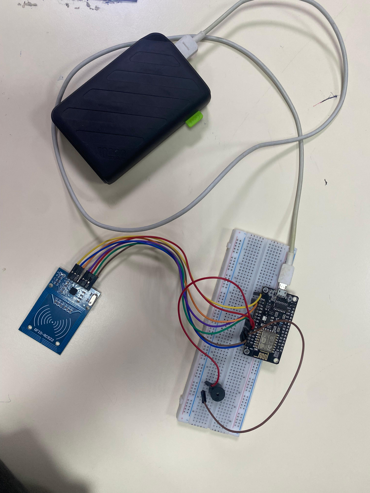

- NodeMCU ESP8266
- RFID-RC522 Module
- RFID Cards/Tags
- Internet/Wi-Fi

---

## ⚙️ Setup Instructions

1. **Clone the project**:
   ```bash
   git clone https://github.com/Anass-NB/ETracker.git
   ```
Setup MySQL database:

Import rfid.sql file to create required tables

Upload firmware:

Upload rfid_esp.ino to your NodeMCU using Arduino IDE

Configure server:

Ensure your server supports PHP and MySQL

Adjust database credentials in database.php

📡 API Endpoints
Example endpoints available in api.php:

/api.php?endpoint=scan

/api.php?endpoint=employee_status&employee_id=3

/api.php?endpoint=present_employees

/api.php?endpoint=daily_attendance&date=2025-07-26

📌 License
MIT License

✍️ Author
Anass NB – LinkedIn – GitHub


---

Let me know if you'd like:
- Dark/light mode screenshots
- GIF demos instead of images
- Multilingual README (e.g., French + English)

I can also generate the actual screenshots from your frontend if you share the rendered HTML or want p
